# GMT Motor Test Kit User Manual

Table Of Content
[TOC]
___

## Working/Test Folder

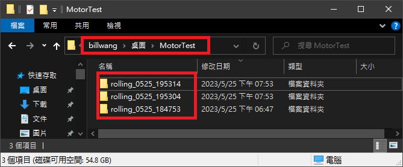

➡️APP初次啟動時會在使用者桌面建立一個名為MotorTest的Working Folder(可以在File Menu中修改) 
➡️每次測試時都會在Working Folder中建立一個Test Folder如 rolling_mmdd_hhmmss(會用目前的日期時間為流水號為Test Folder命名) 
➡️所有測試結果都會存放於此Test Folder

### **Menu and Tool Bar**

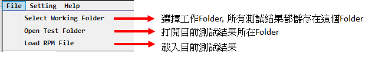

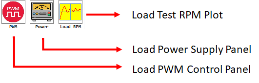

### **PWM Control Panel**

:bulb: 輸入後須按Tab才會修改修改

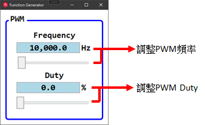

### **Power Supply Control Panel**

:bulb: 輸入後須按Tab才會修改修改

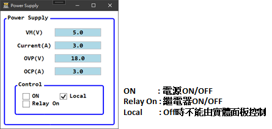

| Name   | Function   |
|------|------|
| VM   | 電壓   |
| Iset | 電流   |
| OVP  | 過壓保護 |
| OCP  | 過流保護 |
___

## ***Rolling Test***

___

### **主要參數**

:bulb: 輸入後須按Tab才會修改修改

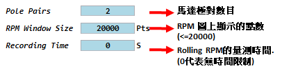 
 
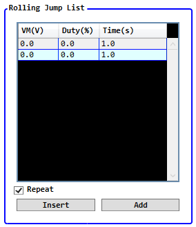

|  Name  |          Function          |
| ------ | -------------------------- |
| Insert | 在選取列下方加入資料       |
| Add    | 在最下方加入資料           |
| Repeat | 重複Rolling List的測試設定 |

👉選取列後按Delete鍵可刪除

___

### **RPM Information: RPM圖上的統計值**

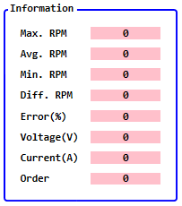

___

### **測試按鈕**

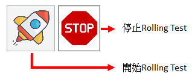

___

### Rolling Plot View

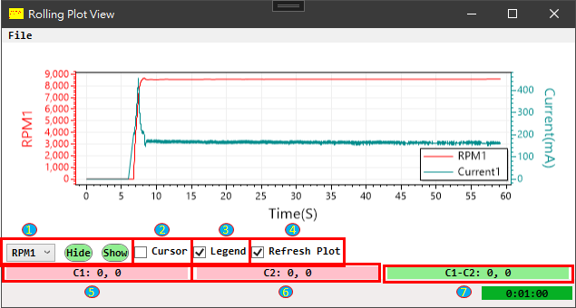

<ol style = " color: blue;  background-color: #f5f5f5; border: 1px solid #ddd;">
<li>顯示或隱藏轉速/電流曲線</>
<li>顯示/隱藏 Cursor</li>
<li>顯示/隱藏 圖例</li>
<li>在測試時可選擇要不要即時更新 Rolling Plot</li>
<li>按 F1 可儲存目前Cursor座標於C1</li>
<li>按 F2 可儲存目前Cursor座標於C2</li>
<li>計算 C1,C2 差值</li>
</ol>

#### 右鍵選單

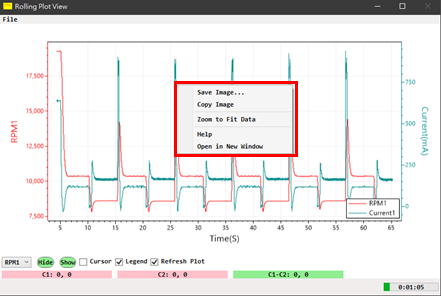

#### 快速鍵

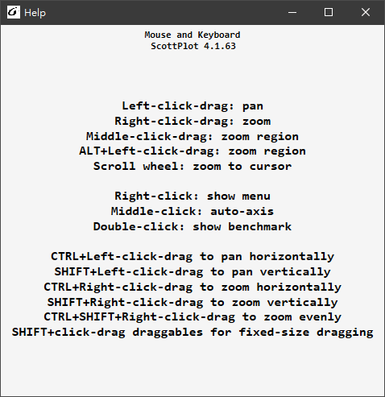

___

## History

V1.0.0.0 Initial Release
___
Copyright :copyright:2023 [Global Mixed-mode Technology Inc.](http://www.gmt.com.tw/) All rights reserved.
